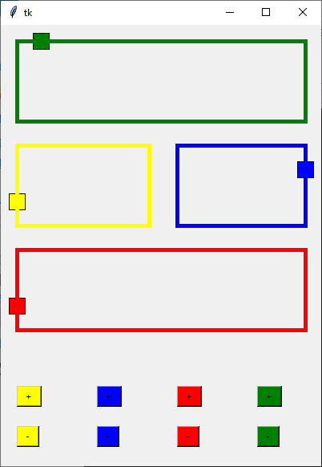

## 💻 Sobre

O projeto final da disciplina consiste na implementação de um programa que simula a dinâmica de quatro trens com os seguintes requisitos:
- Cada trem se locomove independentemente no seu próprio circuito de trilhos e no sentido horário. 
- Não pode haver colisões entre os trens: não pode haver mais de um trem simultaneamente no mesmo seguimento de trilho. 
- Não pode haver deadlocks. 
- Há uma interface que controla as velocidades dos trens. 
- Há uma interface para mostrar as posições dos trens a cada instante.
- Implemente com threads: uma thread para cada trem; uma thread para o painel de controle; uma thread para a visualização dos trens; utilização dos semáforos (mutexs).

Com o uso da 

## Execução

- Faça o download do repositório através do arquivo zip ou do terminal usando o `git clone`;
- Acesse o diretório do projeto pelo seu terminal;
- Execute o comando `python trainssystem.py` para inicializar o projeto (é necessário ter o Python instalado para executar este projeto).

## Interface

## 🦸 Autor

 
 <b>Bruno Valniery</b>

